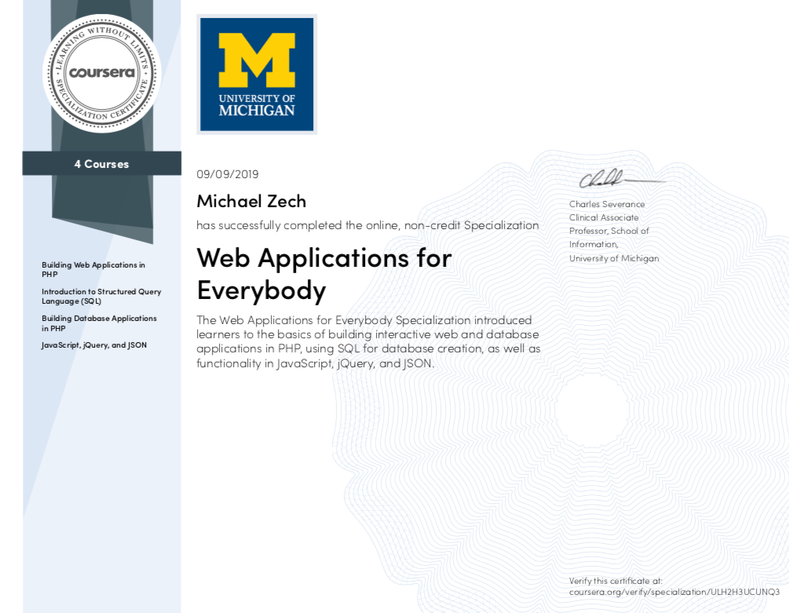

# Resume Registry

Final project from the Coursera-course [Web Applications for Everybody](https://www.coursera.org/specializations/web-applications?) by Charles Severance.




The SQL-statements (provided by the instructor), which are needed for to create the database and the tables:

```
CREATE TABLE Institution (
  institution_id INTEGER NOT NULL KEY AUTO_INCREMENT,
  name VARCHAR(255),
  UNIQUE(name)
) ENGINE=InnoDB DEFAULT CHARSET=utf8;

CREATE TABLE Education (
  profile_id INTEGER,
  institution_id INTEGER,
  rank INTEGER,
  year INTEGER,
  CONSTRAINT education_ibfk_1
    FOREIGN KEY (profile_id)
    REFERENCES Profile (profile_id)
    ON DELETE CASCADE ON UPDATE CASCADE,
  CONSTRAINT education_ibfk_2
    FOREIGN KEY (institution_id)
    REFERENCES Institution (institution_id)
    ON DELETE CASCADE ON UPDATE CASCADE,
  PRIMARY KEY(profile_id, institution_id)
) ENGINE=InnoDB DEFAULT CHARSET=utf8;````

CREATE TABLE Position (
  position_id INTEGER NOT NULL AUTO_INCREMENT,
  profile_id INTEGER,
  rank INTEGER,
  year INTEGER,
  description TEXT,
  PRIMARY KEY(position_id),
  CONSTRAINT position_ibfk_1
    FOREIGN KEY (profile_id)
    REFERENCES Profile (profile_id)
    ON DELETE CASCADE ON UPDATE CASCADE
) ENGINE=InnoDB DEFAULT CHARSET=utf8;

CREATE TABLE Institution (
  institution_id INTEGER NOT NULL KEY AUTO_INCREMENT,
  name VARCHAR(255),
  UNIQUE(name)
) ENGINE=InnoDB DEFAULT CHARSET=utf8;

CREATE TABLE Education (
  profile_id INTEGER,
  institution_id INTEGER,
  rank INTEGER,
  year INTEGER,
  CONSTRAINT education_ibfk_1
    FOREIGN KEY (profile_id)
    REFERENCES Profile (profile_id)
    ON DELETE CASCADE ON UPDATE CASCADE,
  CONSTRAINT education_ibfk_2
    FOREIGN KEY (institution_id)
    REFERENCES Institution (institution_id)
    ON DELETE CASCADE ON UPDATE CASCADE,
  PRIMARY KEY(profile_id, institution_id)
) ENGINE=InnoDB DEFAULT CHARSET=utf8;

```

